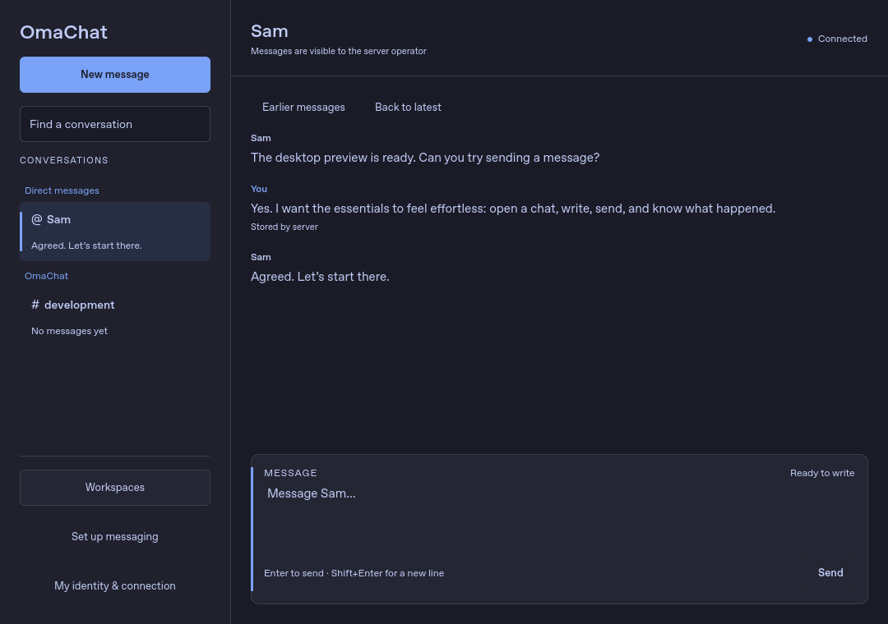
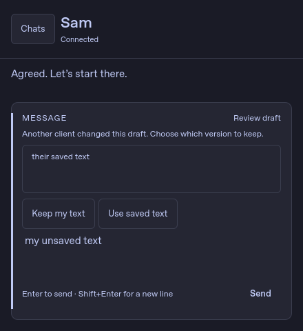

# Authored desktop design: second pass

Used [Authored Frontend Design](https://github.com/tcballard/CodexToolkit/blob/main/skills/authored-frontend-design/SKILL.md), including its frontend doctrine and quality gates. This is a native Qt/QML application; web-specific rules were translated to native controls, accessibility names, keyboard interaction and logical pixels.

## Direction

A quiet conversation workspace: navigation at the edge, a measured reading column, and a writing frame that communicates the state of the user's draft. The signature element is the state-bearing composer frame, with explicit labels for ready, draft, loading, sending, offline and review states. Color reinforces those labels; it never carries the meaning alone.

The user's palette and configured desktop font remain authoritative. No bundled display font, ornamental animation, new network asset, or fixed brand hue is introduced. Typography uses deliberate size/weight roles; the shared tokens now also define control targets, spacing, shape, reading measure and sidebar widths. The static behavior is complete without motion or GPU effects.

## Changes and review

Fresh baseline screenshots were captured before editing. The previous pass's [after images](images/desktop-ux/after/) show that baseline; the new fixture also correctly identifies its example workspace channel.

| Step | Location and state | Result |
| --- | --- | --- |
| 1 | [Conversation navigation](images/desktop-ux-pass2/01-dark-chat.png) | Channels and direct messages have distinct #/@ markers, unread counts have a readable badge, and selection has a persistent edge marker. Workspace labels refresh when metadata arrives. |
| 2 | [Narrow chat](images/desktop-ux-pass2/10-narrow-chat.png) | Connection status is text, controls have 44-unit targets, the composer groups writing and status, and the latest message stays visible after resizing. |
| 3 | [Compact chat](images/desktop-ux-pass2/11-compact-chat.png) | A narrower sidebar preserves reading space between 760 and 1079 units. |
| 4 | [Wide chat](images/desktop-ux-pass2/12-wide-chat.png) | Message and composer measures stop at 820 units rather than stretching across the window. |
| 5 | [Offline draft](images/desktop-ux-pass2/13-offline-draft.png) | Explicit offline framing preserves the draft and disables sending. |
| 6 | [Conflict at 440 × 480](images/desktop-ux-pass2/14-conflict-draft.png) | Both conflict choices remain outside the scrollable explanation. Enter cannot send a draft requiring review. |
| 7 | [Unknown send](images/desktop-ux-pass2/15-unknown-send.png) | Outcome explanation and explicit review action stay grouped with the draft. |
| 8 | [Empty search](images/desktop-ux-pass2/16-filter-empty.png) | Clear restores results and search focus without changing the active draft; Escape also clears the filter. |
| 9 | [Empty chat](images/desktop-ux-pass2/17-empty-chat.png) | Copy identifies the selected conversation and the next action. |
| 10 | [Workspace controls](images/desktop-ux-pass2/09-narrow-workspaces.png) | Themed controls retain reachable dismissal and scrolling with larger targets. |

## Verification

- 41 Python/Qt tests passed, covering real Unix sockets, setup, keyboard entry, theme changes, drafts, close protection, responsive bounds, search recovery, conflict choices and timeline position.
- All four JavaScript suites passed: state, drafts, hosted conversations and theme contrast.
- 17 deterministic QML screenshots captured across light, dark and warm palettes. Three layout modes checked at 440, 860 and 1440 units, plus the normal 1080-unit window.
- The fresh two-daemon hosted fixture passed handles, owner/member permissions, channels, DMs, history paging, receipts and sealed drafts.
- Production Quickshell launched successfully against a fresh local hosted fixture; [native screenshot](images/desktop-ux-pass2/18-native-dark.png).
- Launcher shell syntax and diff whitespace checks passed; source checksums regenerated.

Reading older history deliberately disables following the latest message. Draft edits then preserve the reading position; Back to latest restores following. No automatic animation is required for this behavior.

The native screenshot uses real local hosted data. Other screenshots use deterministic test data. This pass did not test a screen reader, physical display or unusual font/DPI configuration. No server deployment or backend protocol change is included.
