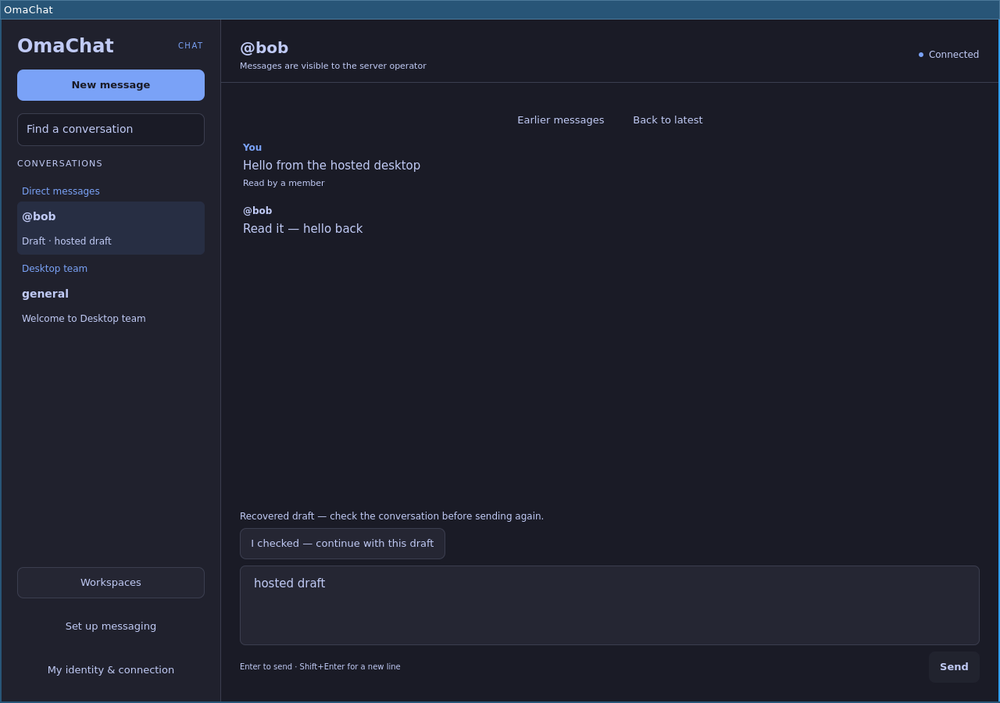
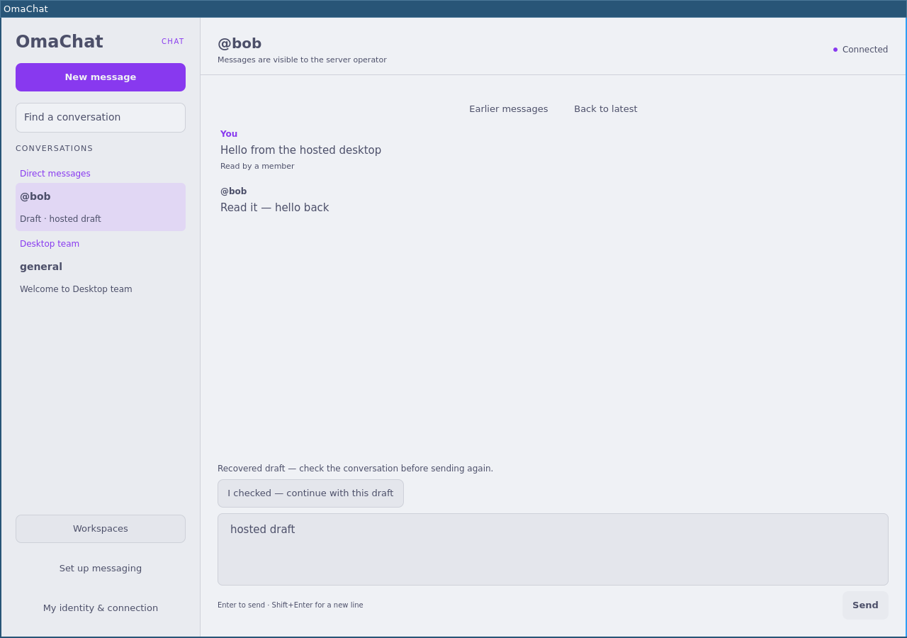

# Desktop UX pass

The [second pass using Authored Frontend Design](desktop-ux-pass2.md) contains the latest design and verification.

Reviewed 2026-10-01 on `feat/desktop-ux-polish`, based on `feat/hosted-only`.
The target is the existing native Quickshell desktop. Nostr remains retired.

Fresh before screenshots were captured and inspected before implementation.
The first ten pairs use the actual QML views with deterministic test data,
1080 × 760 desktop or 440 × 540 narrow windows. Tokyo-style dark, Catppuccin
Latte-style light and warm custom palettes exercise user-supplied colors.
These fixtures do not demonstrate network or server behavior.

## Flow review

| Step | Location | Before | After / health |
| --- | --- | --- | --- |
| 1 | Chat | [Evidence](images/desktop-ux/before/01-dark-chat.png): Mixed emphasis and crowded composer. | **Pass** — Clearer hierarchy, quieter connected state, history controls in the timeline. [Evidence](images/desktop-ux/after/01-dark-chat.png) |
| 2 | Server setup | [Evidence](images/desktop-ux/before/02-dark-setup.png): Default white modal and placeholder-only fields. | **Pass** — Themed surfaces, persistent labels, key explanation and primary save action. [Evidence](images/desktop-ux/after/02-dark-setup.png) |
| 3 | Identity and connection | [Evidence](images/desktop-ux/before/03-dark-identity.png): Repeated handle and overlapping status copy. | **Pass** — One shareable handle, concise connection and operator-trust information. [Evidence](images/desktop-ux/after/03-dark-identity.png) |
| 4 | Workspace management | [Evidence](images/desktop-ux/before/04-dark-workspaces.png): Mixed control styling and ungrouped fields. | **Pass** — Themed selector, grouped create/manage sections, inline actions and owner-only choices. [Evidence](images/desktop-ux/after/04-dark-workspaces.png) |
| 5 | New direct message | [Evidence](images/desktop-ux/before/05-dark-dm.png): No primary action or visible busy state. | **Pass** — Validated handle entry, primary opening action and progress feedback. [Evidence](images/desktop-ux/after/05-dark-dm.png) |
| 6 | Close protection | [Evidence](images/desktop-ux/before/06-dark-close.png): Default white modal broke dark mode. | **Pass** — Themed save/keep/discard hierarchy with existing draft safety preserved. [Evidence](images/desktop-ux/after/06-dark-close.png) |
| 7 | Light theme | [Evidence](images/desktop-ux/before/07-light-chat.png): Inconsistent derived colors. | **Pass** — User background and accent preserved, readable text and matching selections. [Evidence](images/desktop-ux/after/07-light-chat.png) |
| 8 | Light-theme setup | [Evidence](images/desktop-ux/before/08-light-setup.png): Default dialog differed from the application. | **Pass** — Same palette and controls as the conversation surface. [Evidence](images/desktop-ux/after/08-light-setup.png) |
| 9 | Narrow workspace window | [Evidence](images/desktop-ux/before/09-narrow-workspaces.png): Actions could leave the viewport. | **Pass** — Scrollable body and always-reachable Done action at 440 × 540. [Evidence](images/desktop-ux/after/09-narrow-workspaces.png) |
| 10 | Narrow conversation | [Evidence](images/desktop-ux/before/10-narrow-chat.png): Composer and history actions crowded the screen. | **Pass** — Compact composer, larger message text, history actions moved to the timeline. [Evidence](images/desktop-ux/after/10-narrow-chat.png) |

## Theme behavior and accessibility

All surfaces, modal bodies, buttons, fields, dropdown choices, selections and
focus indicators use shared tokens. The Omarchy colors file is polled at most
once per second, including symlink replacements. Without that file, Qt's system
palette supplies the colors. Invalid updates keep the last valid palette.
Contrast correction preserves the background and adjusts text/accent brightness
when needed. Palette tests cover the three pictured themes, low-contrast input,
and all 256 neutral background brightness levels, including difficult mid-tones.

Forms have persistent labels; primary buttons have keyboard focus indicators.
Theme updates preserve draft text, selection and focus. Existing keyboard send,
multiline composition, conflict resolution, pending-send protection and explicit
discard behavior remain covered by Qt interaction tests. A server outage disables
sending even when the local daemon is still connected.

## Native runtime verification

The production `desktop/omachat-desktop` was also launched with Quickshell 0.3.1,
Qt 6.11 and headless Sway against the local hosted fixture with two real daemons.
The fixture passed handle, workspace ownership, channel/DM, paging, receipts and
sealed-draft checks. The running desktop switched from light to dark after the
colors file changed, without restarting; its recovered draft remained present.
The title bar in these images belongs to the test compositor.

## Reproduction and limits

- `QT_QPA_PLATFORM=offscreen python -m unittest discover -s desktop/tests`: 37 tests passed with PySide6 6.8.3.
- `node desktop/tests/test_{state,drafts,hosted,theme}.js` (run each file separately): all four suites passed.
- `QT_QPA_PLATFORM=offscreen python desktop/tests/capture_ux.py OUTPUT_DIR`: ten deterministic screenshots.
- `python3 scripts/test-hosted-desktop.py --serve`: local native-runtime fixture.

No hosted deployment, physical display, screen-reader session or unusual DPI/font
configuration was tested. Short windows intentionally scroll long forms while
keeping dismissal actions visible. Backend deployment/security/recovery work is
tracked separately in the hosted-server plan.
